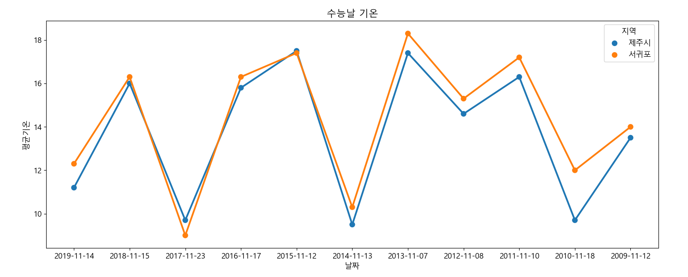
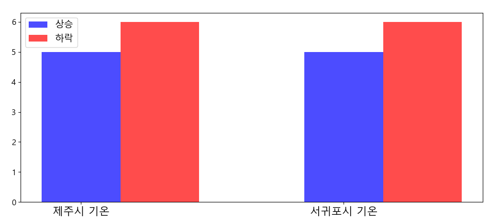
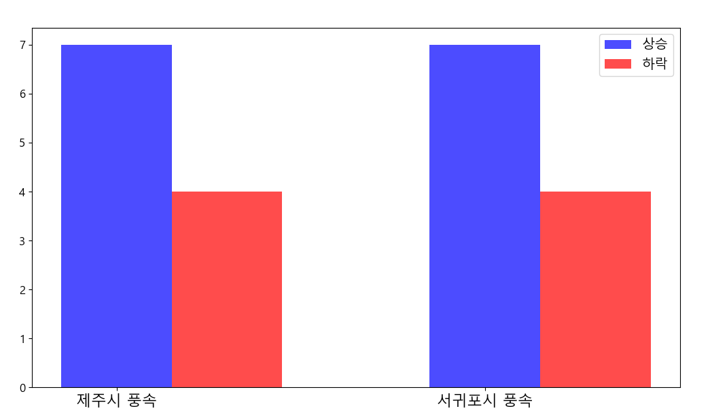
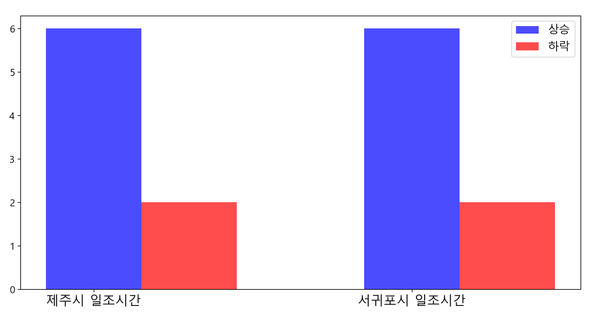
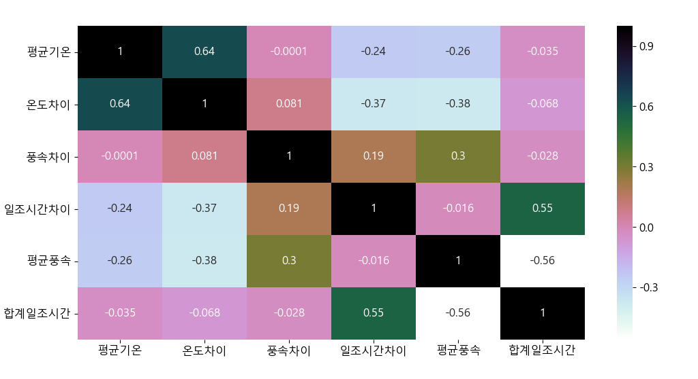
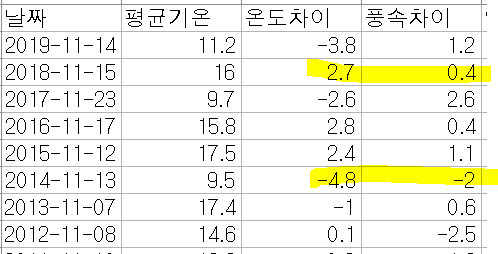

# 수능 날씨 분류

><a href="https://www.ytn.co.kr/_ln/0108_201911131343347274">[날씨] 요란한 비에 첫눈까지... 내일 수능 추위에 황사 </a>
>
><a href="http://www.kyeonggi.com/news/articleView.html?idxno=2195622">수능 한파 찾아온다... 오늘 밤 부터 경기 일부지역·인천 한파 주위보</a>


:snowflake:11월 셋째 주 목요일이 다가오면 우리는 뉴스를 통해 심심치 않게 <strong>'수능 한파'</strong> 에 관한 기사를 읽을 수 있다. 매년 수능 날만 다가오면 날씨가 전날에 비해 급격하게 추워지는 걸까? 라는 의문에서 해당 프로젝트를 시작하게 되었다.
<br><br>
:snowflake: 2019년 ~ 2009년까지의 제주시와 서귀포시의 수능 당일날 평균 기온, 풍속, 일조시간, 그리고 전날과 비교하여 기온, 풍속, 일조시간의 상승과 하락을 분류하여 그래프로 출력하였다.

<br>

<br>

<br>


## Code

<strong>1. data load</strong>

```python
data=pd.read_csv('weather_data.csv', encoding='cp949')


jeju_index=[]
seogwipo_index=[]
for a in range(len(data)):
    if (data['지역'].iloc[a] == '제주시'): #제주시라는 값을 가지는 index 저장
        jeju_index.append(a)
    if(data['지역'].iloc[a]=='서귀포'):  #서귀포라는 값을 가지는 index 저장
        seogwipo_index.append(a)
```

:snowflake: csv파일로 저장된 데이터를 pands를 통해 불러왔다<br>

:snowflake: 제주시와 서귀포시를 구분할 예정이라 제주시의 index값과 서귀포시의 index값을 각각 따로 리스트에 추가하였다.

<br>

<br>

<strong>2. 한글 깨짐 방지</strong>

```python
# matplotlib에서 한글이 깨지지 않게 해줌
mpl.rcParams['axes.unicode_minus'] = False
plt.rcParams["font.family"] = 'Malgun Gothic'
plt.rcParams["font.size"] = 12
plt.rcParams["figure.figsize"] = (14,4)
data['지역'].astype(str)
```

:snowflake:matplot를 이용할 때 한글이 제대로 출력될 수 있도록 코드를 추가하였다.

<br>

<br>

<strong>3. 평균기온 꺾은선 그래프로 출력</strong>

```python
sns.pointplot(data=data, x="날짜", y="평균기온", hue="지역")
plt.xlabel('날짜')
plt.ylabel('평균기온')
plt.title('수능날 기온',fontsize=15)
plt.show()
```

:snowflake:제주시와 서귀포시의 수능 당일날 평균 기온을 꺾은선 그래프로 출력하였다. <br>




<br>

<br>

<strong>4. 분류작업</strong>

```python
jeju_minus=0; #제주시 기준 수능 전 날보다 추운 날
jeju_plus=0; #제주시 기준 수능 전 날보다 따뜻한 날
for b in range(len(jeju_index)):
    if(data['온도차이'].iloc[b]>0):
        jeju_plus= jeju_plus + 1
    if(data['온도차이'].iloc[b]<0):
        jeju_minus= jeju_minus + 1

seogwipo_minus=0 #서귀포시 기준 수능 전 날보다 추운 날
seogwipo_plus=0; #서귀포시 기준 수능 전 날 보다 따뜻한 날
for c in range(len(seogwipo_index)):
    if(data['온도차이'].iloc[c]>0):
        seogwipo_plus= seogwipo_plus + 1
    if(data['온도차이'].iloc[c]<0):
        seogwipo_minus= seogwipo_minus + 1


jeju_hightwind=0;
jeju_lowwind=0;
for d in range(len(jeju_index)):
    if(data['풍속차이'].iloc[d]>0):
        jeju_hightwind = jeju_hightwind + 1;
    if(data['풍속차이'].iloc[d]<0):
        jeju_lowwind = jeju_lowwind + 1;

seogwipo_hightwind=0;
seogwipo_lowwind=0;
for e in range(len(seogwipo_index)):
    if(data['풍속차이'].iloc[e]>0):
        seogwipo_hightwind = seogwipo_hightwind + 1;
    if(data['풍속차이'].iloc[e]<0):
        seogwipo_lowwind = seogwipo_lowwind + 1;

        
jeju_longsun=0;
jeju_shortsun=0;
zero=0;
for f in range(len(jeju_index)):
    if(data['일조시간차이'].iloc[f]>0):
        jeju_longsun=jeju_longsun+1
    if(data['일조시간차이'].iloc[f]<0):
        jeju_shortsun=jeju_shortsun+1
    if(data['일조시간차이'].iloc[f]==0):
        zero=zero+1;

seogwipo_longsun=0;
seogwipo_shortsun=0;
for g in range(len(seogwipo_index)):
    if(data['일조시간차이'].iloc[g]>0):
        seogwipo_longsun=seogwipo_longsun+1;
    if(data['일조시간차이'].iloc[g]<0):
        seogwipo_shortsun=seogwipo_shortsun+1;
    if(data['일조시간차이'].iloc[g]==0):
        zero=zero+1;
```

:snowflake: 평균기온, 풍속, 일조시간을 분류하였다.<br>

:snowflake:온도차이 = 수능 당일 평균기온 - 수능 전날 평균기온 ▶ 온도차이 > 0 =  수능 당일 기온 > 수능 전날 기온 <br>

:snowflake:풍속차이 = 수능 당일 평균 풍속 - 수능 전날 평균 풍속 ▶ 풍속차이 > 0 = 수능 당일 풍속 > 수능 전날 풍속<br>

:snowflake:일조시간차이 = 수능 당일 일조시간 - 수능 전날 일조시간 ▶ 일조시간차이 > 0 = 수능 당일 일조시간 > 수능 전날 일조시간

<br>

<br>

<strong>5. 분류한 데이터 그래프화</strong>

```python
bar_width=0.3
ypoint1=[jeju_plus,seogwipo_plus]
ypoint2=[jeju_minus,seogwipo_minus]
ypoint3=[jeju_hightwind,seogwipo_hightwind]
ypoint4=[jeju_lowwind,seogwipo_lowwind]
ypoint5=[jeju_longsun, seogwipo_longsun]
ypoint6=[jeju_shortsun, seogwipo_shortsun]
N=len(data['지역'].unique())
index = np.arange(N)

label=['제주시 기온','서귀포시 기온']
temp_bar1=plt.bar(index, ypoint1,color='b',alpha=0.7,width=0.3)
temp_bar2=plt.bar(index+bar_width,ypoint2,color='r',alpha=0.7,width=0.3)
plt.xticks(index,label,fontsize=16)
plt.legend((temp_bar1[0],temp_bar2[0]),('상승','하락'),fontsize=14)
plt.show()

label_wind=['제주시 풍속','서귀포시 풍속']
wind_bar1=plt.bar(index,ypoint3,color='b',alpha=0.7,width=0.3)
wind_bar2=plt.bar(index+bar_width,ypoint4,color='r',alpha=0.7,width=0.3)
plt.xticks(index,label_wind,fontsize=16)
plt.legend((wind_bar1[0],wind_bar2[0]),('상승','하락'),fontsize=14)
plt.show()

label_sun=['제주시 일조시간','서귀포시 일조시간']
sun_bar1=plt.bar(index,ypoint5, color='b',alpha=0.7, width=0.3)
sun_bar2=plt.bar(index+bar_width,ypoint6, color='r',alpha=0.7, width=0.3)
plt.xticks(index,label_sun,fontsize=16)
plt.legend((sun_bar1[0], sun_bar2[0]),('상승','하락'),fontsize=14)
plt.show()
```







:snowflake:11년동안 총 5번의 기온 상승과 6번의 기온 하락이 있었다. 기온차이는 크게 차이를 보이지 않았지만 풍속과 일조시간은 차이를 많이 보였다. `일조시간 같은 경우 0값이 있어 0값은 빼고 카운트했다.`<br>

<br>

<strong>6. heatmap</strong>

```python
plt.figure(figsize=(12,6))
sns.heatmap(data=data.corr(), annot=True, cmap='cubehelix_r')
plt.show()
```

:snowflake: 히트맵 출력결과는 다음과 같다<br>



:snowflake:평균기온에서 온도차이가 나왔고 합계 일조시간에서 일조시간 차이가 나왔기 때문에 둘은 연관성을 보이고 있지만 나머지 컬럼들과의 연관성은 적은 것으로 나타났다.<br>

:snowflake:

<br>

<br>

<br>

## 결론

:snowman: 개인적으로 수능날은 그 전날에 비해 항상 추울 것이라고 생각했지만 기온이 높은 경우와 낮은 경우가 비슷해서 놀랐다.<br>

:snowman: 하지만 풍속을 분류하면서 꽤 차이점을 찾을 수 있었다.  온도가 높아도 풍속이 수능 전날에 비해 높은 날이 있었다. 반대로 온도는 전날에 비해 낮았지만 풍속은 전날에 비해 낮은 경우도 있었다. <br>



`첫번째 밑줄 같은 경우 수능 당일의 기온이 높았지만 풍속은 수능 당일이 강했다. `<br>

` 두번째 밑줄은 수능 당일의 기온이 낮았지만 풍속은 수능 당일이 약했다.`<br>

:snowman:수능 전날과 당일날의 온도, 풍속, 일조시간을 비교하면서 비교적 온도와 풍속이 서로 관련이 깊어보였지만 히트맵상에서는 마이너스 값 탓인지 아니면 관련이 없는 것인지 관련성이 나타나지 않아 아쉬웠다. <br>


